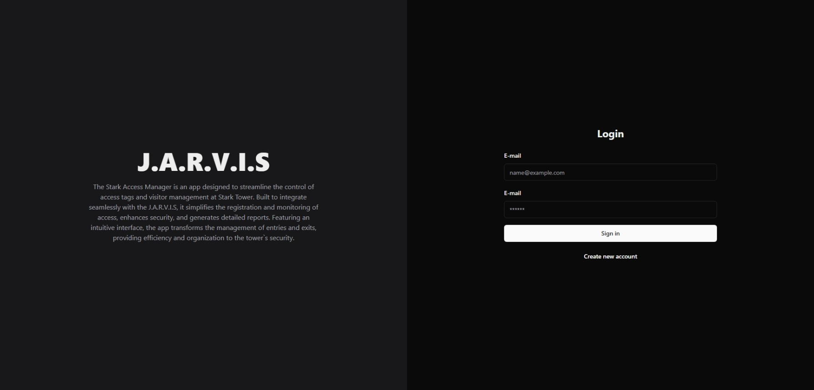
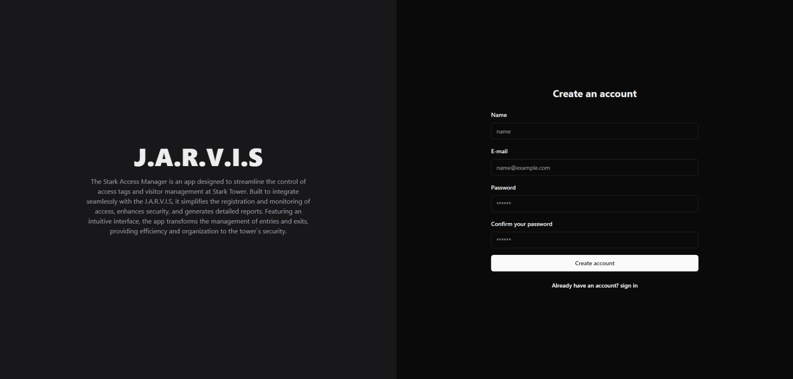
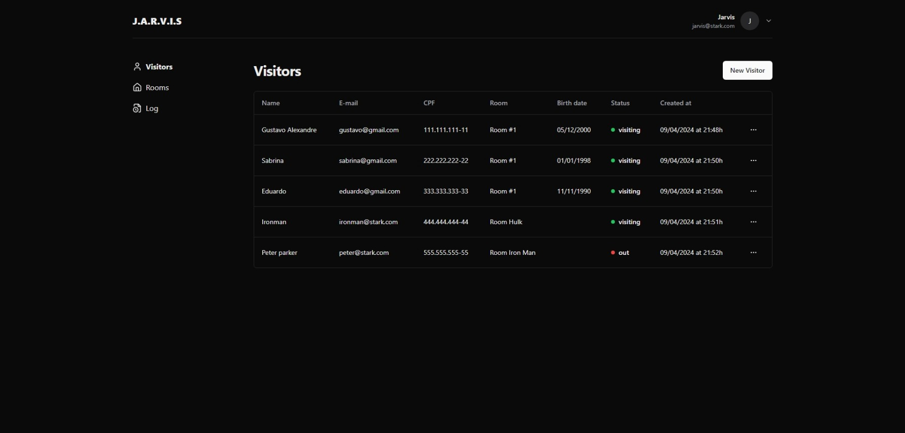
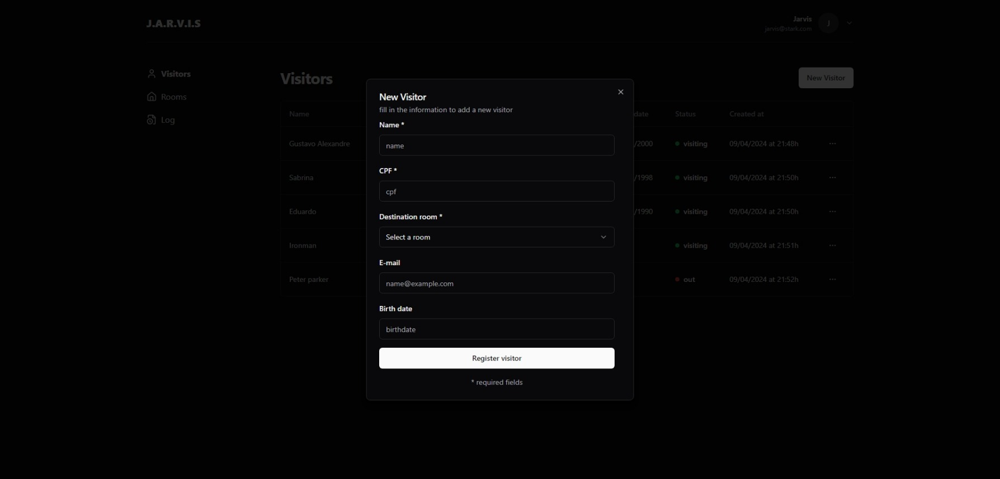
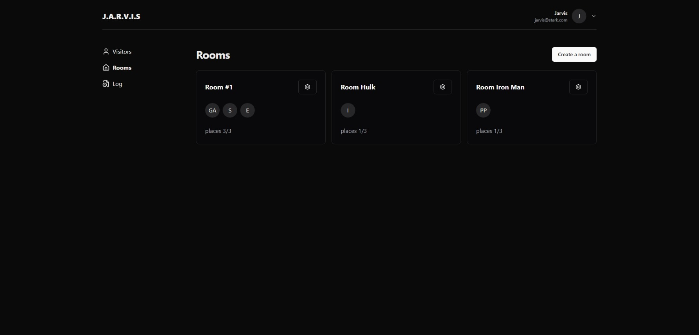
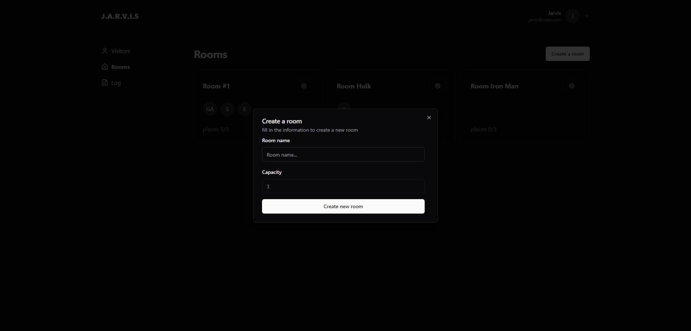
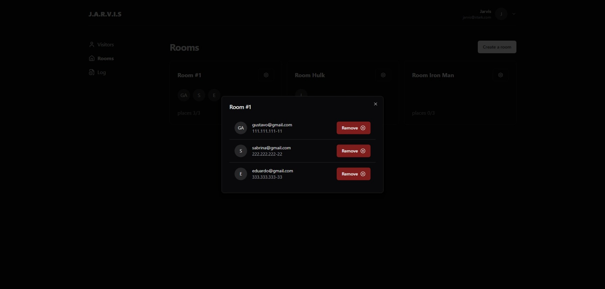
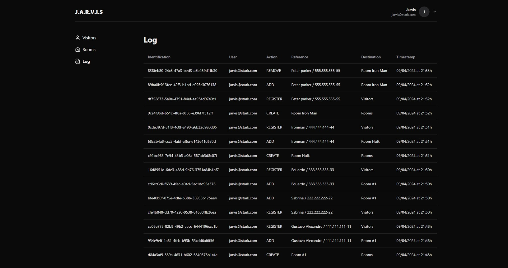

<h1 align="center">
    <br>
    J.A.R.V.I.S
</h1>

<p align="center">
  

  

  
</p>

### SignIn
</img>

### SignUp
</img>

### Visitors list
</img>

### Add a new visitor
</img>

### Rooms list
</img>

### Create a new room
</img>

### Room view
</img>

### Log
</img>

## 👨‍💻 Technologies

- [React.Js](https://pt-br.react.dev/)
- [Next.Js](https://nextjs.org/)
- [Typescript](https://www.typescriptlang.org/)
- [Shadcn.ui](https://ui.shadcn.com/)
- [Tailwind](https://tailwindcss.com/)
- [React Hook Form](https://react-hook-form.com/)
- [Zod](https://zod.dev/)
- [Postgresql](https://www.postgresql.org/)
- [Prisma](https://www.prisma.io/)
- [Docker](https://www.docker.com/)

## 📖 How To Use

```bash
# Clone this repository
$ git clone https://github.com/Shadaw/jarvis.git

# Go into the repository
$ cd jarvis

# Install dependencies
$ yarn

# up the docker container
$ docker compose up

# create an .env file by copying .example.env

# run the prism migrations
$ npx prisma migrate deploy

# Run project
$ yarn dev
```
